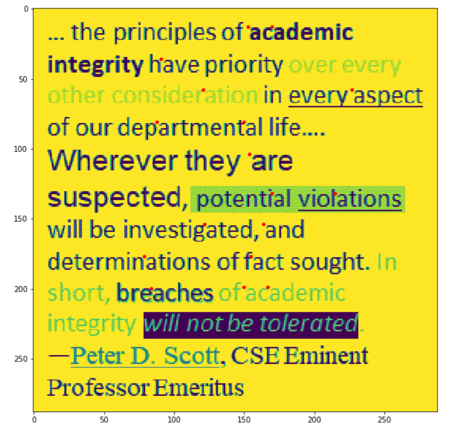

# Template-matching
Edge Detection and Character Detection using various Template matching algorithms. Techniques like applying edge detection filters, smoothening, resizing, normalized cross correlation, convolutions, padding have been employed to improve the performance of the algorithm. The metric used for measuring the performance is F1 score. Current best F1 score for detection of A, B and C is 77%.

The below image shows the character "A" which are detected in the image market with red dots on the leftmost pixel of A's location.
Similar detection can be performed for all characters.

